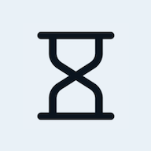

<div align="center">
  
  <br />
  <h1><a href="https://countdown.sascha.app/" rel="noopener noreferrer">Countdown</a></h1>
  <strong>⏲️ An offline-ready countdown timer.</strong>
  <br />
  <br />
  <a href="https://github.com/saschazar21/countdown/actions/workflows/deploy-to-netlify.yml"></a> <a href="https://github.com/saschazar21/countdown/actions/workflows/build-and-test.yml"></a>  
  <br />
  <br />
  
  <br />
  <br />
  <br />
</div>

## About

This repository contains the source code for [countdown.sascha.app](https://countdown.sascha.app), a simple countdown application running in the browser.

## Build Setup

```bash
# install dependencies
$ npm install # or: yarn install

# serve with hot reload at localhost:3000
$ npm run dev # or: yarn dev

# build for production and launch server
$ npm run build # or: yarn build
$ npm run serve # or: yarn serve
```

## License

Licensed under the MIT license.

Copyright ©️ 2021 [Sascha Zarhuber](https://sascha.work)
